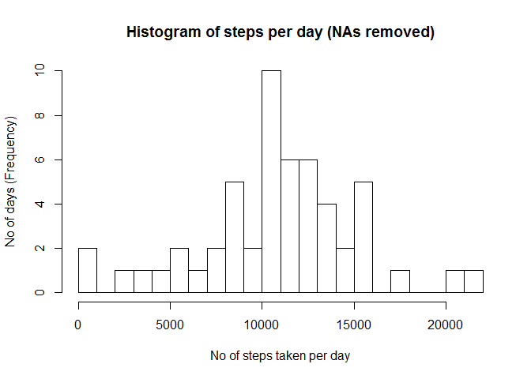
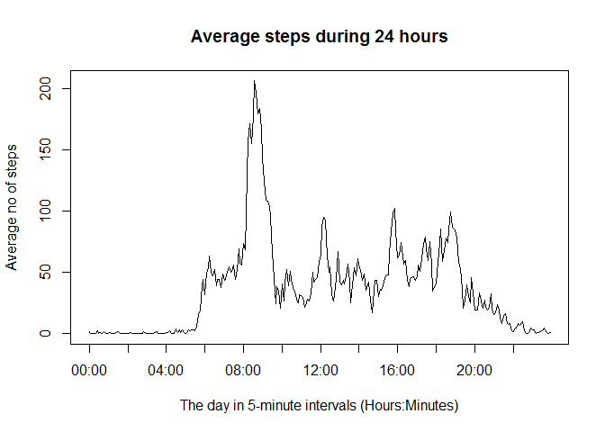
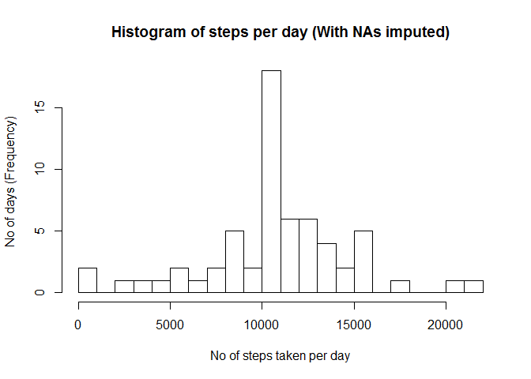
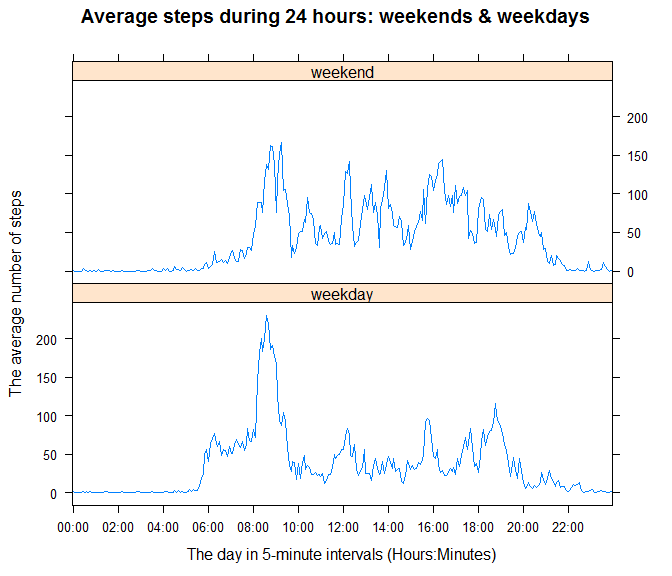

# Reproducible Research: Peer Assessment 1


## Loading and preprocessing the data

After unzipping the data file, the next step is to **load** the data. We then **convert** *date* strings to date class instances, and *interval* integer identifiers to factor levels.

```r
raw <- read.csv("activity.csv")
tidy <- transform(raw, interval = as.factor(interval))   #not really necessary
tidy$date <- as.Date(tidy$date, "%Y-%m-%d")
```


## What is mean total number of steps taken per day?

For this part of the assignment we **ignore the missing values** in the dataset, and remove the observations containing NAs from the dataset.

The following histogram depicts the frequency for the total number of steps taken each day.

```r
suppressMessages(library(dplyr))
steps.by.date <- 
    tidy %>%
    filter(!is.na(steps)) %>% 
    group_by(date) %>% 
    summarize(steps = sum(steps))

#calculate no of bars so that increment is 1000
groups <- ceiling(max(steps.by.date$steps) / 1000)

hist(steps.by.date$steps, breaks = groups,    #hist break increment: 1000
     xlab = "No of steps taken per day", 
     ylab = "No of days (Frequency)", 
     main = "Histogram of steps per day (NAs removed)")
```

 

The **mean** and the **median** of the total number of steps taken per day is as follows:

```r
mean.per.date   <- format(mean(steps.by.date$steps), 
                          trim = TRUE, nsmall = 2, scientific = FALSE)
median.per.date <- format(median(steps.by.date$steps), 
                          trim = TRUE, nsmall = 0, scientific = FALSE)
```
- Mean (*NAs ignored*): **10766.19**
- Median (*NAs ignored*): **10765**


## What is the average daily activity pattern?

This is a time series plot of the 5-minute interval (x-axis) and the average number of steps taken, averaged across all days (y-axis).

```r
steps.by.interval <- 
    tidy %>%
    filter(!is.na(steps)) %>% 
    group_by(interval) %>% 
    summarize(steps = mean(steps))

with(steps.by.interval,
     #cast factor to integer in order to be able to draw line, not just points
     plot(as.integer(interval), steps, type = "l", xaxt = "n",  #no X ticks
          xlab = "The day in 5-minute intervals (Hours:Minutes)", 
          ylab = "Average no of steps", 
          main= "Average steps during 24 hours")
)
#do not draw X axis again, just draw ticks every two hours (24 x 5 mins)
axis(side = 1, at = seq(1, 288, by = 24), tick = TRUE, lwd = 0, lwd.ticks = 1, 
     labels = c("00:00", "02:00", "04:00", "06:00", "08:00", "10:00", 
                "12:00", "14:00", "16:00", "18:00", "20:00", "22:00")
)
```

 

The 5-minute interval, on average across all the days in the dataset, that contains the **maximum number of steps** is given by

```r
most.active <- with(steps.by.interval, interval[which.max(steps)])
```
and is the interval with identifier **835** (first digit(s) correspond to the hour of the day, last two digits to the minutes of the hour).


## Imputing missing values

The presence of missing days may introduce bias into some calculations or summaries of the data. In previous sections we have ignored NA values by removing the corresponding observations from the dataset.

The dataset contains 17568 rows. The total number of **missing values** in the dataset is as follows.

```r
na.date <- sum(is.na(tidy$date))
na.interval <- sum(is.na(tidy$interval))
na.steps <- sum(is.na(tidy$steps))
```
- *date* column: 0 rows with NA
- *interval* column: 0 rows with NA
- *steps* column: 2304 rows with NA

In this section we impute the missing STEP values. The strategy we opt for is to **fill in the NAs with the mean value for the corresponding 5-minute interval**. Those mean values have been calculated in the previous section (*steps.by.interval* variable).

We create a new dataset that is equal to the original dataset but with the missing data filled in. The new dataset is contained in the *tidy.complete* variable.

```r
size <- nrow(tidy)
steps.complete <- vector(length = size)
for (i in 1:size) {
    if (is.na(tidy$steps[i])) {
        idx <- which(steps.by.interval$interval == tidy$interval[i])
        steps.complete[i] <- round(steps.by.interval$steps[idx])
    }
    else steps.complete[i] <- tidy$steps[i]    #just copy the value
}

tidy.complete <- cbind(tidy[, c("date", "interval")], steps = steps.complete)
```

A histogram depicting the frequency for the total number of steps taken each day is given below. In contrast to the first histogram that ignored NA values this one takes NA values into account, as discussed above.

```r
steps.by.date.cmp <- 
    tidy.complete %>%
    group_by(date) %>% 
    summarize(steps = sum(steps))

hist(steps.by.date.cmp$steps, breaks = groups,    #hist break increment: 1000
     xlab = "No of steps taken per day", 
     ylab = "No of days (Frequency)", 
     main = "Histogram of steps per day (With NAs imputed)")
```

 

The **mean** and the **median** of the total number of steps taken per day (with NAs imputed) is as follows:

```r
mean.per.date.cmp   <- format(mean(steps.by.date.cmp$steps), 
                              trim = TRUE, nsmall = 2, scientific = FALSE)
median.per.date.cmp <- format(median(steps.by.date.cmp$steps), 
                              trim = TRUE, nsmall = 0, scientific = FALSE)
```
- Mean (*NAs imputed*): **10765.64**
- Median (*NAs imputed*): **10762**

Recall that with NAs ignored (removed from the dataset) for the number of steps per day the mean was **10766.19**, and the median **10765**. The mean has changed only slightly, but as we see from the two histograms the frequency of the segment containing the mean / median has increased with imputing NAs (frequency > 15 instead of 10). Therefore, **imputing NAs has reinforced the values around the mean**.     
On the other hand the change in the median is due to the fact that imputing NAs has changed the number of days taken into consideration.

```r
no.days <- nrow(steps.by.date)
no.days.cmp <- nrow(steps.by.date.cmp)
```
Initially the days where **53**, but with imputed NA values the number of days became **61**.


## Are there differences in activity patterns between weekdays and weekends?

To compare the activity between weekdays and weekends we will use the dataset with the imputed values.

First we separate the dataset into *weekday* and *weekend* observations, by **adding a new factor variable** in the dataset with two levels ("weekday" and "weekend") indicating whether a given date is a weekday or weekend day.    
Note that when we compare a day name it is important to make sure we are using the **correct locale**, since days have different names in different languages.

```r
#set locale to US so that comparison of day names is in English
loc <- Sys.getlocale(category = "LC_TIME")    #store current locale settings
#be careful: locale ID depends on OS
loc.US.windows <- "us"; loc.US.ubuntu <- "en_US.utf8"
Sys.setlocale("LC_TIME", loc.US.windows)

steps.by.interval.wday <- 
    tidy.complete %>%
    filter( ! (weekdays(date) %in% c("Saturday", "Sunday"))) %>%    #NOT in
    group_by(interval) %>% 
    summarize(steps = mean(steps)) %>% 
    mutate(workday = factor("weekday", levels = c("weekday", "weekend")))
steps.by.interval.wend <- 
    tidy.complete %>%
    filter(weekdays(date) %in% c("Saturday", "Sunday")) %>%
    group_by(interval) %>% 
    summarize(steps = mean(steps)) %>% 
    mutate(workday = factor("weekend", levels = c("weekday", "weekend")))

steps.by.interval.workday <- 
    rbind(steps.by.interval.wday, steps.by.interval.wend)

#restore the locale to original
Sys.setlocale("LC_TIME", loc)
```

The following plot presents the 5-minute intervals (x-axis) and the average number of steps taken, averaged across all weekday days or weekend days (y-axis).

```r
suppressMessages(library(lattice))
plot <- 
    xyplot(steps ~ interval | workday, 
           data = steps.by.interval.workday, layout = c(1, 2), type = "l", 
           xlab = "The day in 5-minute intervals (Hours:Minutes)", 
           ylab = "The average number of steps", 
           main = "Average steps during 24 hours: weekends & weekdays", 
           scales = list(      #set tick marks for interval
               x = list(at = seq(1, 288, 24),    #tick every 120 mins (24 x 5)
                        labels = c("00:00", "02:00", "04:00", "06:00", 
                                   "08:00", "10:00", "12:00", "14:00", 
                                   "16:00", "18:00", "20:00", "22:00")
                        )
               )
           )
print(plot)
```

 

As expected, during weekends we have less activity early in the morning (it presents a peak after 8:00 in weekdays), while the activity seems to be more equally distributed across the day in the weekends than in weekdays, where another peak appears around 19:00.
